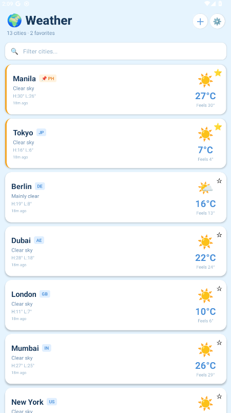
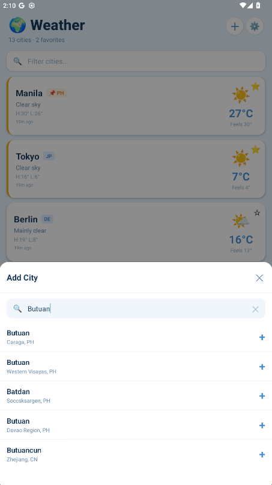
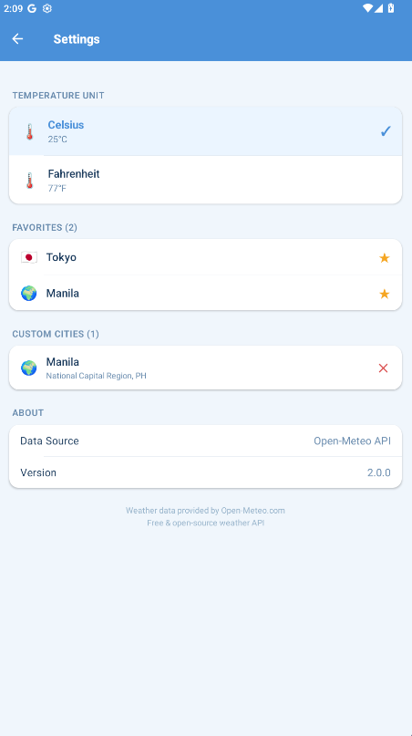

🌦️ WeatherApp

A modern, production-ready mobile weather application built with React Native (Expo).

Real-time global weather • Favorites system • Custom city search • Persistent settings • Clean modern UI

 

 
📱 Download APK

👉 https://expo.dev/accounts/jethzki/projects/WeatherApp/builds/e3ba7cad-38d4-46d3-9151-92176f0e593f

✨ Features
🏠 Home Screen

🌍 12 preloaded global cities

🔍 Real-time search & filtering

➕ Add custom cities via geocoding modal

⭐ Favorites pinned to top (highlighted)

⏳ Skeleton loading animation

🔄 Pull-to-refresh support

📊 Details Screen

🎨 Gradient hero weather card

🕒 24-hour hourly forecast (horizontal scroll)

📅 7-day forecast with temperature range bars

🌡️ Feels-like temperature

💧 Humidity

💨 Wind speed with level descriptions

☀️ UV Index (color-coded badge)

🌅 Sunrise & Sunset

🕓 Relative update timestamps

⭐ Favorite toggle

⚙️ Settings

🌡️ Toggle °C / °F (persisted via AsyncStorage)

⭐ Manage favorites

🗺️ Manage custom cities

  
  
  

ℹ️ App info & API attribution
🛠️ Tech Stack
<table> <tr> <td align="center"><strong>Framework</strong></td> <td align="center"><strong>Language</strong></td> <td align="center"><strong>Navigation</strong></td> <td align="center"><strong>State</strong></td> </tr> <tr> <td align="center">   React Native      Expo SDK 55 </td> <td align="center">   JavaScript (ES6+) </td> <td align="center">   React Navigation v7 </td> <td align="center">   Context API + useReducer </td> </tr> <tr> <td align="center"><strong>Storage</strong></td> <td align="center"><strong>API</strong></td> <td align="center"><strong>UI</strong></td> <td align="center"><strong>Build</strong></td> </tr> <tr> <td align="center">   AsyncStorage </td> <td align="center">   Open-Meteo API  Geocoding API </td> <td align="center">   expo-linear-gradient </td> <td align="center">   Android APK      EAS Build </td> </tr> </table>
